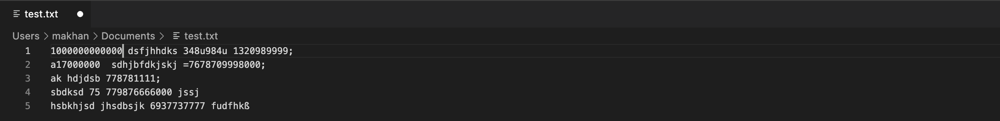
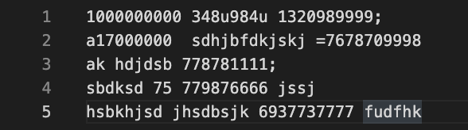
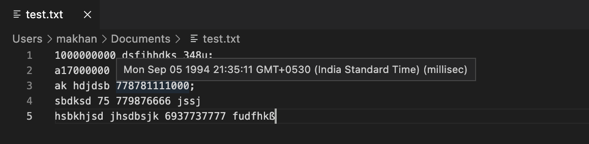

# Epoch-Converter README

This extension will add an **unobtrusive** *Human-Readable time* tag right next to any unix epoch timestamps in the editor.
* By Unobtrusive it means that the tag generated will not be selectable and will not change the basic structure of the text in editor whatsoever.
* It will be very helpful to those who want to refer to real dates for every timestamp in the editor so that they can double check their epoch number.
> Note: It will only get the Human-Readable time of timestamps ahead of 1 Jan 1980.

## Features:

### This Extension comes with two commands:

* getHRT: To generate the **unobtrusive** Human-Readable time tags inline with the timestamp i.e right next to timestamp.

* rmvHRT: To remove the Human-Readable time tags generated by previous command.

> Note: To give a command first you have to open the command pallete. For Mac: "Cmd+Shft+p", For Windows: "Ctrl+Shft+p".

* Additionally, there is a hover feature available now, which will show the *Human-Readable time* for any epoch number which we hover on.
> It can be configured on/off in settings, (default is on)

It accepts both types of timestamps i.e in seconds or in milliseconds.
> Configurable to UTC/IST(default).

## Shortcuts:

### Convert: 

* For Mac: "Shft+Option+c"
* For Windows/Linux: "Shft+Alt+c"

### Reverse: 

* For Mac: "Shft+Option+r"
* For Windows/Linux: "Shft+Alt+r"

## Example:

* **Before:**

* **After:**

* **Hover:**

