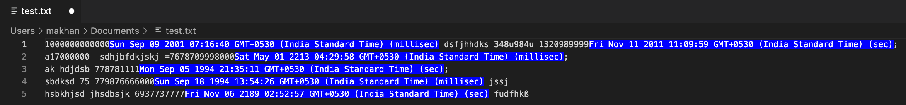

# Epoch-Converter README

This extension will write Human-Readable time right next to any unix epoch timestamps in the editor.
It will be very helpful to those who want to refer to real dates for every timestamp in the editor so that they can double check their epoch number.
> Note: It will only convert the timestamps ahead of 1 Jan 1980.

## Features:

### This Extension comes with two commands:

* Convert: To generate the Human-Readable time inline with the timestamp i.e right next to timestamp.

* Reverse: To remove the Human-Readable time generated by previous command.

> Note: To give a command first you have to open the command pallete. For Mac: "Cmd+Shft+p", For Windows: "Ctrl+Shft+p".

## Shortcuts:

### Convert: 

* For Mac: "Shft+Option+c"
* For Windows/Linux: "Shft+Alt+c"

### Reverse: 

* For Mac: "Shft+Option+r"
* For Windows/Linux: "Shft+Alt+r"

## Example:

* Before:

* After:

